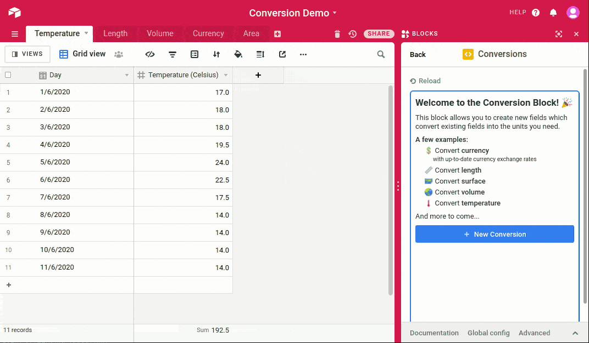

# Conversion Block

This [**airtable block**](https://airtable.com/developers/blocks) allows you to create new fields which **convert existing fields into the units you need**.

It includes: currencies, lengths, surfaces, volumes, temperatures... and more to come!

## Use cases

Airtable is a great tool to collaborate with your team: its real-time collaboration features and user friendly interfaces allow anyone to use it without having to think about how it is working!

You can store your pending sales, your product catalogs, your next projects... but often you don't have a full control over the data. Maybe someone else created the table, maybe it was filled using a CSV, or maybe it is connected to an Airtable Form?

No matter how your table was filled, you probably wished to convert a field into another format/unit and that's why I built this block!

The Converter Block helps you to automatically create new fields converting values from other fields into the right format/unit.

If you store your sales on Airtable, you probably have one field containing the amount in US dollars, you can now create another field in euros (or any other currency) that will automatically convert the amount using the lastest currency exchange rates!

If you store the list of your employees and their respective sizes to send them goodies, you probably stored the size in whatever unit your prefered. But maybe the website you use to order the goodies requires another unit. You can now convert these values in a few clicks with the Conversion Block!

## Next steps

I implemented 5 conversions: currency, length, area, volume, temperature.

Some of them are a synchronous calculation and could be replaced with a formula, but this block is also working with asynchronous conversions like "currency" that require to fetch first the currency exchange rates of the day.

Thanks to this system, we could easily add more complex conversions like changing the file type/size/quality of file attachments. Any asynchronous operation which converts a value into another one is possible.

## Demo

